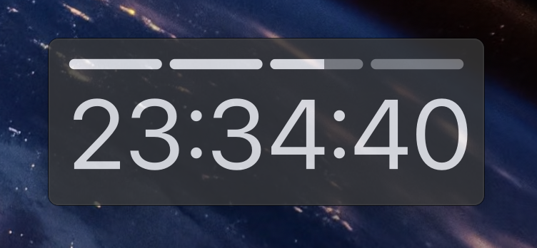
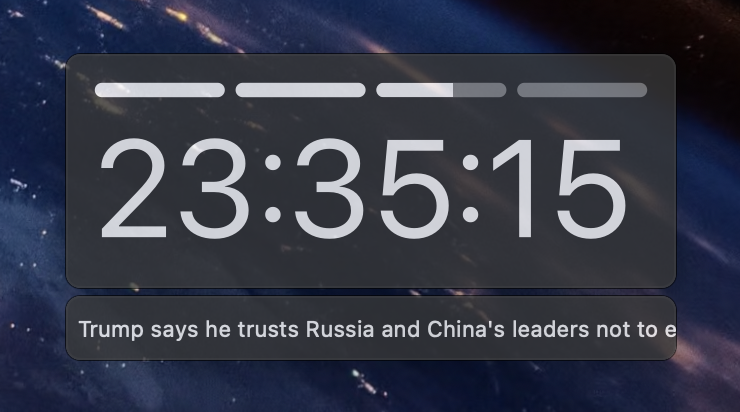
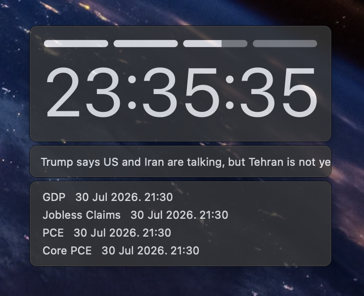
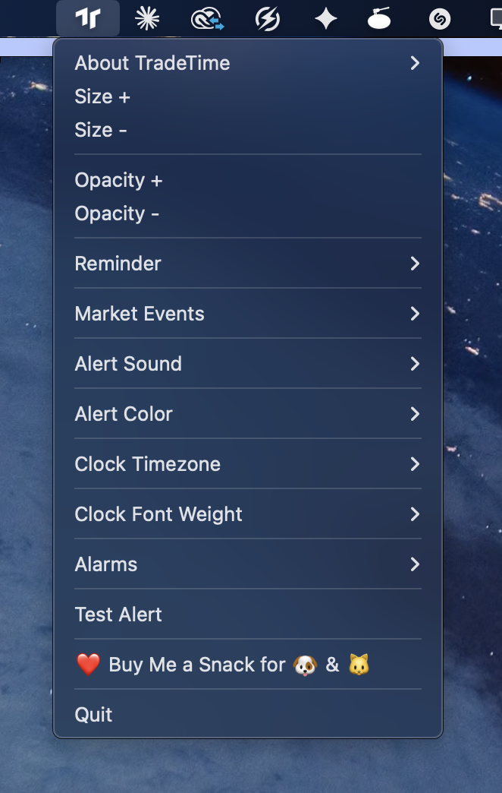

# TradeTime

A lightweight always-on-top clock overlay for crypto/futures trading. It sits on top of your
trading window and shows the real time plus a 4-hour candle progress bar, so you always know
how far the current 4H candle has progressed without switching tabs.

 



## Features

**Clock & candle timer**
- Always-on-top window that stays above your trading platform
- Live clock, down to the second, with a selectable display timezone
- 4-segment progress bar showing how far the current 4-hour candle has progressed (always
  calculated in UTC, independent of the display timezone — matches exchange kline close times:
  UTC 00:00 / 04:00 / 08:00 / 12:00 / 16:00 / 20:00)
- Adjustable size, opacity, clock font weight (Ultralight–Black), and alert color
- Draggable — click and drag the box anywhere on screen

**Alerts & alarms**
- 5 minutes before every hourly segment closes, the border and clock digits flash for 10
  seconds, then stay highlighted until the top of the hour, then snap back to normal with a
  sound alert
- Add up to 10 custom alarms (daily-repeating or one-time), editable/removable from the menu
  bar
- Custom alert color, selectable alert sound with instant preview, and a "Test Alert" menu item

**Breaking News** *(optional, toggle from the menu bar)*
- Keyword-filtered news ticker sourced from the Finnhub news API (`general` + `crypto`
  categories), polled every 10 seconds
- Surfaces the most keyword-relevant headline from each polling window (falls back to the
  latest headline if nothing matches), then keeps cycling through everything matched in the
  last 10 minutes so the ticker keeps moving even when fresh news is sparse — old headlines
  age out automatically
- Plain white scrolling marquee, stacked above the Market Events panel when both are enabled



**Market Events** *(optional, toggle from the menu bar)*
- Economic calendar countdown (CPI, Core CPI, PPI, Core PPI, NFP, Unemployment, GDP, Retail
  Sales, Jobless Claims, PCE, Core PCE) sourced from the FRED (Federal Reserve Economic Data)
  API
- Shows a preview while the next release is more than 12 hours away, switches to a live
  countdown inside the 12-hour window, and automatically rolls over to the next upcoming
  release
- Groups same-day releases into multiple lines instead of only showing one

Breaking News and Market Events can both be on at once — Breaking News stacks on top, Market
Events right below it:



**Persistence**
- Size, opacity, alert sound/color, timezone, font weight, alarms, and Market Events /
  Breaking News toggles are all remembered across restarts
  (saved to `~/.bitcoin_candle_clock_config.json`)

## Requirements

- macOS
- Python 3.9+
- [PySide6](https://pypi.org/project/PySide6/)

## Run from source

```bash
git clone <this-repo-url>
cd trade_time
pip3 install -r requirements.txt
export FRED_API_KEY="your-fred-api-key"        # optional, needed for Market Events
export FINNHUB_API_KEY="your-finnhub-api-key"  # optional, needed for Breaking News
python3 main.py
```

A clock box appears near the top of the screen, and an icon shows up in the menu bar. All
settings live under that menu bar icon. Both API keys are optional — the clock, candle timer,
and alarms all work fully without them; only Market Events / Breaking News stay off until a key
is set.

## Build a standalone .app

To get a double-clickable app instead of running from the terminal:

```bash
pip3 install -r requirements.txt   # includes pyinstaller
pyinstaller TradeTime.spec
```

The build reuses the bundled `TradeTime.icns` app icon automatically. The finished app is at
`dist/TradeTime.app` — copy it to `/Applications` to install:

```bash
cp -R dist/TradeTime.app /Applications/
```

> PyInstaller does not cross-compile — you need to run the build on macOS itself.

## Usage

All settings live under the menu bar icon:



| Action | How |
|---|---|
| Move the clock | Click and drag the box |
| Resize | Menu bar icon → `Size +` / `Size -` |
| Adjust opacity | Menu bar icon → `Opacity +` / `Opacity -` |
| Change alert sound | Menu bar icon → `Alert Sound` (click to preview) |
| Change alert color | Menu bar icon → `Alert Color` |
| Change display timezone | Menu bar icon → `Clock Timezone` |
| Change clock font weight | Menu bar icon → `Clock Font Weight` |
| Test the alert | Menu bar icon → `Test Alert` |
| Add an alarm | Menu bar icon → `Alarms` → `+ Add Alarm...` → enter `HH:MM` → choose `Repeat Daily` or `Once` |
| Edit/delete an alarm | Menu bar icon → `Alarms` → pick the alarm → `Edit Time/Repeat` or `Delete` |
| Toggle Market Events / Breaking News | Menu bar icon → `Market Events` → `Economic Events` / `Breaking News` |
| Quit | Menu bar icon → `Quit` |

## macOS notification permission

On first launch, macOS may ask whether Terminal (or Python) can send notifications — allow it
so alert notifications work. You can toggle this later under
**System Settings → Notifications**. Alert sounds use the built-in macOS system sounds
(`/System/Library/Sounds/*.aiff`), so nothing extra needs to be installed.

## Config file

All settings are stored at:

```
~/.bitcoin_candle_clock_config.json
```

Delete this file to reset everything to defaults.

## Customization

Most tunable values live as constants near the top of `main.py`:

| Constant | What it controls |
|---|---|
| `BASE_WIDTH` | Base window width |
| `MIN_SCALE` / `MAX_SCALE` / `SCALE_STEP` | Size range and step |
| `MIN_OPACITY` / `MAX_OPACITY` / `OPACITY_STEP` | Opacity range and step |
| `ALERT_COLOR_CHOICES`, `BG_COLOR`, `SEG_ON_COLOR` | Colors |
| `BLINK_DURATION_SECONDS` / `BLINK_INTERVAL_MS` | Alert blink timing |
| `ALERT_VOLUME` / `SOUND_REPEAT` | Alert volume / repeat count |
| `TIMEZONE_CHOICES` | Timezones offered in the menu |
| `FONT_WEIGHT_CHOICES` | Font weights offered in the menu |
| `MAX_CUSTOM_ALARMS` | Max number of custom alarms (default 10) |
| `ECONOMIC_EVENTS_DEF` | Which FRED series are tracked for Market Events |
| `BREAKING_NEWS_KEYWORDS` | Keywords used to score/filter Breaking News headlines |
| `NEWS_POLL_INTERVAL_SEC` / `NEWS_ROTATION_WINDOW_SEC` | Breaking News polling interval and rotation window |

## Setting up API keys

Market Events uses the [FRED API](https://fred.stlouisfed.org/docs/api/fred/) and Breaking News
uses the [Finnhub API](https://finnhub.io/docs/api). Both have free tiers, and `main.py` reads
both keys from environment variables (`FRED_API_KEY`, `FINNHUB_API_KEY`) — no key is stored in
the source code, so it's safe to keep this repo public.

Both keys are optional. Without them, TradeTime runs completely normally — the clock, candle
timer, and alarms are unaffected — only the Market Events / Breaking News toggles stay inactive
(and print a one-line notice in the console) until a key is provided.

1. Get a free key:
   - FRED: [fred.stlouisfed.org/docs/api/api_key.html](https://fred.stlouisfed.org/docs/api/api_key.html)
   - Finnhub: [finnhub.io/register](https://finnhub.io/register)
2. Set them as environment variables before launching the app:

   ```bash
   export FRED_API_KEY="your-fred-api-key"
   export FINNHUB_API_KEY="your-finnhub-api-key"
   ```

   To make this permanent, add those two lines to your shell profile (`~/.zshrc` on modern
   macOS) instead of typing them every time.

> **Packaging as a .app:** a GUI app launched by double-clicking in Finder does **not** inherit
> environment variables from your shell profile — only apps launched from a terminal do. If you
> build a `.app` with PyInstaller and plan to open it by double-clicking, either launch it from
> Terminal (`open /Applications/TradeTime.app`) after `export`-ing the keys in that same shell
> session, register them once with `launchctl setenv FRED_API_KEY "..."` /
> `launchctl setenv FINNHUB_API_KEY "..."` (session-wide, survives Finder launches), or keep a
> separate local copy of `main.py` with the keys filled in directly for your own personal build
> (just don't commit that copy).

> **Sharing your built .app with many people:** if you plan to distribute a build with your own
> keys baked in, keep in mind Finnhub's free tier caps out at 60 requests/minute total across
> everyone using that key — this app already uses ~12 requests/minute per running instance, so
> more than a handful of simultaneous users will start hitting rate limits. FRED's free tier
> (120 requests/minute) has much more headroom for shared use. For any wider distribution, it's
> best for each user to grab their own free key instead of sharing one.

## Known limitations

- Some trading apps use special macOS window levels that can occasionally appear above the
  always-on-top clock.

## Support

If TradeTime is useful for your trading, you can support development from the app's menu bar:
`❤️ Buy Me a Snack for 🐶 && 🐱` (KakaoPay for Korea-based users, USDT/BTC for everyone else).

## License

No license has been set yet — add one (e.g. MIT) before publishing if you want to make reuse
terms explicit.
